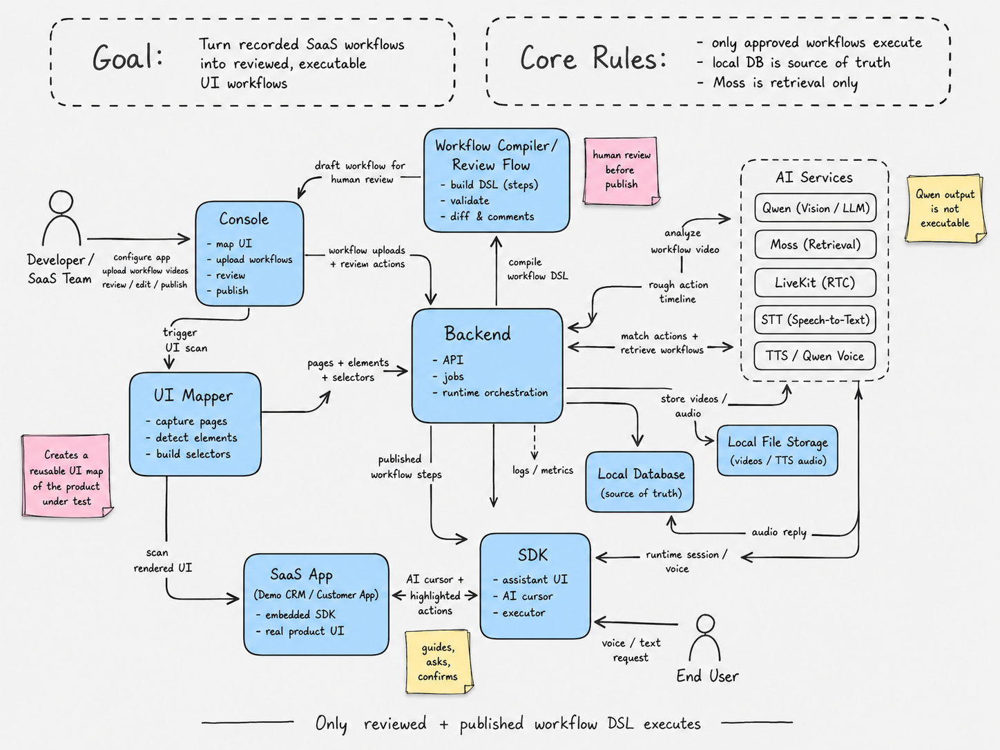
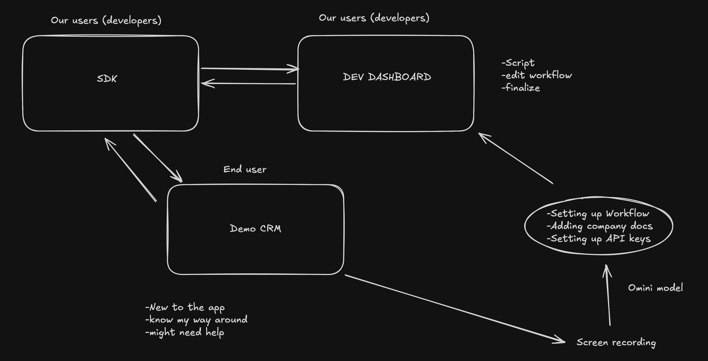
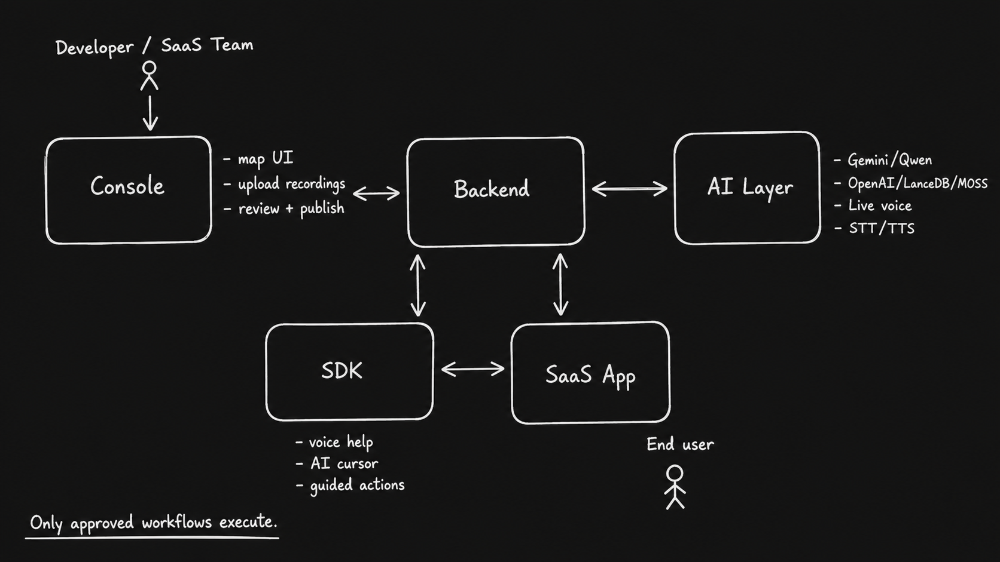

# Mia

## Turn one screen recording into an AI onboarding and support agent.

Mia watches how a task is completed in your product, maps that task to the real UI, and helps every new user complete it through voice or text.

Instead of sending users to documentation or support tickets, Mia appears inside the product, explains what to do, points at the right controls, and guides the user step by step.

> Record it once. Review it once. Let Mia support every user.



## What Mia Does

Imagine a new employee opening a CRM for the first time.

They do not know where to request access, upload documents, update a lead, or finish onboarding. Instead of searching through documentation, they ask Mia:

> "Help me request CRM access."

Mia then:

1. Understands what the employee wants.
2. Uses the mapped product UI to find the right page or element.
3. Highlights the next button, field, table, or menu.
4. Explains what information is needed.
5. Waits for confirmation when an action is sensitive.
6. Continues until the task is complete.

The user can speak naturally or use text throughout the workflow.

## One Video Becomes A Reusable Workflow

Creating support with Mia starts with one demonstration:

1. **Record the task**
   Complete the workflow once while recording your screen.

2. **Upload the video**
   Mia analyzes the visible actions and the goal of the workflow.

3. **Match the product UI**
   Mia connects each action to the real buttons, forms, routes, and selectors in your application.

4. **Review and publish**
   Your team checks the generated steps, edits instructions, and approves what can run.

5. **Support every user**
   Mia can now guide customers through the same task inside your product.

```text
One screen recording
        |
        v
Mia understands the task
        |
        v
Your team reviews the steps
        |
        v
The workflow is published
        |
        v
Users receive voice, text, pointing, and guided actions
```

## See Mia In Action

### Manage Everything From The Mia Console

See application health, mapped UI elements, workflow status, recent jobs, API keys, logs, and provider readiness in one place.


### Turn Recordings Into Reviewed Workflows

Upload a screen recording, follow its processing status, and open the generated workflow for review before publishing it.


### Connect Workflows To The Real Product UI

Mia maps actual buttons, links, fields, labels, routes, and selectors so every guided action points to a visible interface element.


### Guide Users Inside The Real Product

This is the kind of product users work in every day. Mia lives right here, helping them find the next step without leaving the screen.


## The Customer Experience

Mia is an in-product copilot, not another help center.

- Ask questions using text or speech.
- Hear Mia respond with natural voice output.
- See an AI cursor move to the correct control.
- Get the next button, field, menu, or table highlighted on screen.
- Complete forms with guided prompts and safe action execution.
- Pause, resume, or switch between voice and text.
- Confirm important actions before Mia continues.
- Stay inside the product from question to completion.

## Example Workflows

Mia can help a new employee or customer:

- Request CRM access.
- Submit missing onboarding documents.
- Add and qualify a new lead.
- Complete a security checklist.
- Configure notifications and preferences.
- Find a customer account.
- Update an opportunity stage.
- Invite a teammate.
- Generate a report.
- Complete first-day onboarding.

Each workflow is made of visible interactions. Every click, form fill, navigation step, or confirmation maps back to reviewed UI context so the user understands what Mia is doing.

## Why Mia

Traditional product support usually stops at instructions.

| Traditional support | Mia |
| --- | --- |
| Sends users to documentation | Guides users inside the product |
| Explains where to click | Points at and highlights the correct control |
| Repeats the same answers | Reuses reviewed workflows for every user |
| Separates voice, chat, and onboarding | Combines voice, text, UI mapping, and guided actions |
| Leaves users to finish alone | Stays with the user until completion |

## One Platform, Two Experiences

### Product Teams

Teams use the Mia Console to:

- Create application records.
- Configure SDK keys and allowed browser origins.
- Map routes, pages, forms, tables, modals, and hidden UI states.
- Upload workflow recordings.
- Review generated workflow steps.
- Edit instructions, selectors, and confirmation rules.
- Publish approved workflows.
- Test Mia against the mapped product UI.
- Monitor logs, sessions, prompts, transcripts, targets, and actions.

### Product Users

Users see Mia directly inside the application. They ask for help, follow the visual guidance, provide information when requested, and complete tasks without leaving the current screen.



## Human Reviewed, AI Guided

Mia does not let a model freely control the application.

- AI-generated workflows must be reviewed before publication.
- Only reviewed and published workflow DSL can execute in the SDK.
- Unmatched recording actions compile to non-executable review blockers, never confirmation placeholders.
- Approval is bound to the latest UI map and target fingerprints; completing a new scan moves stale approved or published workflows back to review.
- Q&A-only mode is enforced by the backend and cannot return workflows or element actions.
- Every direct ad hoc element action requires user confirmation; reviewed workflows may automate only approved non-consequential steps.
- Action completion is reported only after the SDK verifies a URL, value, control-state, or relevant DOM change.
- Manual-only steps guide the user without clicking for them.
- Runtime-sensitive SDK and backend routes use scoped API keys.
- SDK keys are bound to an app and allowed browser origins.
- Workflow actions, prompts, targets, and sessions are logged.

This keeps the experience helpful without removing control from the product team or the user.

## Technology Behind Mia

Mia brings together five focused parts:

- **Mia Console** for app setup, UI mapping, workflow review, SDK keys, logs, and testing.
- **Backend** for API routes, workflow processing, runtime orchestration, SQLite persistence, file storage, and semantic indexing.
- **UI Mapper** for scanning the real product, detecting visible elements, and building reusable selectors.
- **Mia SDK** for the assistant panel, voice controls, AI cursor, highlights, DOM context, and guided workflow execution inside the host app.
- **AI and retrieval services** for recording analysis, request understanding, workflow matching, embeddings, voice, and screen-aware help.

The default stack uses Gemini for model reasoning and live voice tokening, OpenAI embeddings with LanceDB for retrieval, SQLite for persistence, local file storage for uploads/audio, and the browser SDK for in-app guidance. Optional LiveKit transport and Qwen TTS endpoints are available when configured.

Screen sharing is only needed for visual surfaces the DOM cannot describe well, such as canvas charts, images, videos, PDFs, or custom-rendered UI. For ordinary product screens, Mia uses mapped UI data and SDK runtime context.



## Repository

```text
mia-onboarding-agent/
├── backend/              # TypeScript backend, API routes, jobs, UI mapper, providers
├── backend/console/      # Self-hosted Mia admin console
├── sdk/                  # Embeddable browser SDK
├── example/demo-crm+sdk/ # Demo CRM with the SDK installed
├── docs/                 # Production, SDK, API, security, database, troubleshooting docs
└── flowcharts/           # Product screenshots and generated architecture diagrams
```

## Run Locally

Install dependencies, create a local environment file, build the workspaces, and start the backend:

```bash
npm install
cp .env.example .env
npm run build
npm run dev:backend
```

The backend listens on `http://localhost:4000` by default.

Required minimum production configuration:

```bash
GEMINI_API_KEY=...
OPENAI_API_KEY=...
BOOTSTRAP_ADMIN_TOKEN=long-random-bootstrap-token
MIA_SECRET_ENCRYPTION_KEY=long-random-secret-encryption-key
```

`BOOTSTRAP_ADMIN_TOKEN` is only needed while creating the first console admin. Keep `MIA_SECRET_ENCRYPTION_KEY` stable for the lifetime of the database so saved scan credentials remain decryptable.

Start the Mia Console:

```bash
npm run dev:console
```

Start the demo CRM:

```bash
npm --prefix example/demo-crm+sdk run dev
```

The console opens on `http://localhost:5173` and the demo CRM opens on `http://localhost:3000/dashboard/default`.

## First App Setup

1. Open the console and create the first admin with `BOOTSTRAP_ADMIN_TOKEN`.
2. Create an application record with the app name, slug, and base URL.
3. Configure the app UI scan profile: default routes, auth mode, login selectors when needed, ignored selectors, redacted selectors, and optional same-origin route discovery.
4. Run the UI mapper from Console -> UI Map.
5. Use interactive scan for manual SSO login, modals, drawers, dropdowns, row action menus, and other hidden states.
6. Upload a workflow recording.
7. Review the generated workflow and clear safety blockers.
8. Publish the workflow only when the selectors, steps, and confirmation rules are correct.
9. Create an app-bound server integration key with `runtime:tokens:create` and keep it out of browser code.
10. Add an authenticated host-backend endpoint that exchanges the signed-in user for a short-lived runtime token, then install the SDK using the console-generated snippet.
11. Open Console -> Test Mia to dry-run answers, pointing, and action resolution before giving the workflow to users.

Integration keys are bound to one `appId` and the browser origins for which they may mint tokens. Only short-lived `mia_rt_...` tokens belong in browser memory. Admin and integration keys are server-side credentials.

## Privacy And Safety

The SDK redacts visible DOM text by default before context leaves the browser. Keep `redactText` enabled unless the host app has reviewed the data that may be sent to the backend or model provider:

```ts
AIOnboardingAgent.init({
  appId: "app_local",
  backendUrl: "http://localhost:4000",
  tokenProvider: async () => {
    const response = await fetch("/api/mia/runtime-token", { method: "POST" });
    if (!response.ok) throw new Error("Unable to start Mia");
    return response.json();
  },
  enableVoice: true,
  privacy: {
    redactText: true,
    redactedSelectors: ["[data-private]", ".billing-card"],
    telemetry: { mode: "events_only" },
    redactScreenFrame: (canvas, context) => {
      context.clearRect(0, 0, 220, 80);
    }
  }
});
```

For a demo or reviewed internal app where Mia should point at visible UI by spoken request, set `privacy.redactText: false` or provide stable readable selectors. Use a dedicated demo or test account for authenticated UI ingestion.

URL query strings, page titles, user metadata, and telemetry payloads are excluded by default. Workflow values stay in browser memory and are cleared at the end of a run; Mia never collects password, payment, token, or similar secret fields. Retention, export, and user deletion controls are under Console -> Settings -> Privacy.

## Docker

```bash
cp .env.example .env
docker compose up --build
```

The Docker image serves the console at `/` and the API under `/api/v1`. The backend container stores SQLite, uploads, generated audio, and LanceDB semantic index files in the `mia-data` volume.

Read [Production deployment](docs/production.md) before exposing the service publicly.

## Documentation

- [Production deployment](docs/production.md)
- [SDK integration](docs/sdk.md)
- [HTTP API](docs/api.md)
- [Security model](docs/security.md)
- [Database operations](docs/database.md)
- [Troubleshooting](docs/troubleshooting.md)
- [Contributing](CONTRIBUTING.md)
- [Security policy](SECURITY.md)

## Useful Commands

```bash
npm run verify
npm run build
npm run test
npm run dev:backend
npm run dev:console
npm run build:console
npm run build:demo
npm run pack:sdk
```

## Vision

Every product should be able to support a new user from their first question to a completed task.

Mia turns the workflows already known by your team into interactive, reusable support that speaks, explains, points, confirms, and helps users finish the work.
