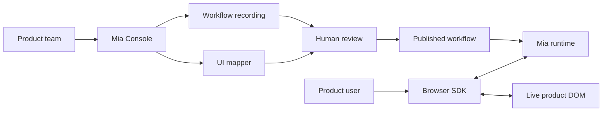
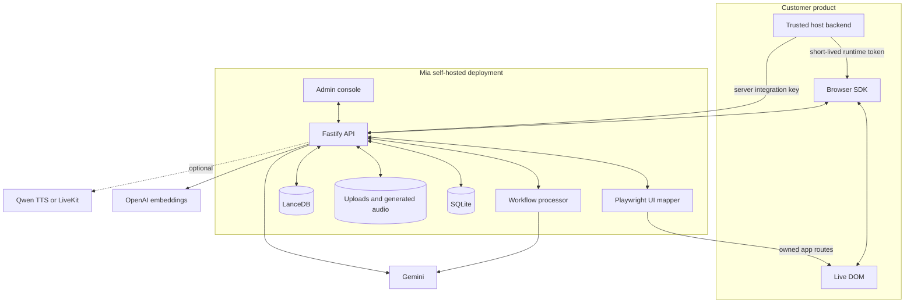

# Mia

[](https://github.com/Sricharan07/mia-onboarding-agent/actions/workflows/ci.yml)
[](LICENSE)

Self-hosted AI onboarding and in-product support that turns recorded tasks into reviewed workflows. Mia answers questions, points to live DOM elements, and performs approved browser actions through an embeddable SDK.

> Record the task, review the generated workflow, then guide users inside the product where the work happens.

Mia is pre-1.0. The backend, console, SDK source, and demo are available now; `@mia/onboarding-agent` has not yet been published to npm.

## How It Works



1. Record a task while completing it in the product.
2. Upload the recording and map the product's real routes and controls.
3. Review selectors, action safety, instructions, and confirmation rules.
4. Publish only after every workflow blocker is resolved.
5. Install the SDK and verify it from the real host application.
6. Let users ask by text or voice, follow Mia's cursor, and confirm actions.

## Product Experience

### For product teams

The Mia Console provides one operational path from setup to production:

- Configure an app, providers, scan authentication, privacy, and retention.
- Discover routes or select routes explicitly, then run scan preflight.
- Map normal pages and interactive states such as menus, drawers, and modals.
- Upload recordings and review every generated workflow step.
- Resolve stale selectors and safety blockers before approval and publication.
- Create an app-bound server integration key and copy the SDK integration code.
- Preview resolution in Test Mia, then prove the SDK is live in the host app.
- Inspect runtime targets, action verification, usage, sessions, and redacted telemetry.

### For product users

Mia appears inside the host product rather than sending users to a separate help center. Users can:

- Ask what a screen means or how to complete a task.
- Use text, open-mic voice, or hold `Control+Space` for push-to-talk.
- See Mia point to and highlight the correct visible control.
- Confirm direct clicks or focus actions before they run.
- Follow a reviewed workflow through forms, navigation, and manual-only steps.
- Stop Mia, pause voice, or close the panel at any time.

Mia is DOM-first. Screen sharing is optional and user-initiated for surfaces the DOM cannot describe well, including canvas, images, video, PDFs, and custom-rendered interfaces.

## Safety Model

Mia does not give a model unrestricted control of the browser.

- Only reviewed and published workflow DSL can execute as a workflow.
- Unmatched recording actions become non-executable review blockers.
- Approval is bound to the current UI map and target fingerprints.
- A new completed UI map moves stale approved or published workflows back to review.
- Q&A-only apps cannot return workflows or element actions.
- Direct ad hoc actions always require user confirmation.
- Runtime targets must resolve to one visible, enabled, unobstructed live DOM element.
- Bounding boxes position the cursor but never select an action target.
- Completion requires a verified URL, value, control-state, or relevant DOM change.
- Secret, credential, payment, and similar fields remain manual-only.

Browser code receives only short-lived `mia_rt_...` runtime tokens. Reusable admin and integration credentials stay on trusted servers.

## Architecture



The supported production shape is one backend process serving the console at `/` and APIs under `/api/v1`, with persistent local data. SQLite and the in-process controls are intentionally single-replica; use an external database and distributed rate limiting before designing a multi-replica deployment.

## Repository

```text
mia-onboarding-agent/
|-- backend/              # API, jobs, UI mapper, providers, persistence
|-- backend/console/      # Self-hosted admin console
|-- sdk/                  # Embeddable browser SDK
|-- example/demo-crm+sdk/ # CRM demo with the SDK installed
`-- docs/                 # Operations, integration, security, and release guides
```

## Requirements

- Node.js 22 or newer
- npm 10 or newer
- Docker and Docker Compose for the containerized deployment
- Gemini credentials for workflow analysis and live voice
- OpenAI credentials for embeddings and semantic retrieval

## Run Locally

```bash
npm install
npm ci --prefix backend/console
npm ci --prefix example/demo-crm+sdk
cp .env.example .env
npm run build
npm run dev:backend
```

In separate terminals:

```bash
npm run dev:console
npm --prefix example/demo-crm+sdk run dev
```

The backend defaults to `http://localhost:4000`, the Vite console to `http://localhost:5173`, and the demo CRM to `http://localhost:3000/dashboard/default`.

Production validates the bootstrap and encryption secrets as at least 32 characters. Generate independent values rather than using the examples literally:

```bash
openssl rand -hex 32
```

Set the result separately for `BOOTSTRAP_ADMIN_TOKEN` and `MIA_SECRET_ENCRYPTION_KEY`. The bootstrap token is needed only for first-admin creation. The encryption key must remain stable for the database lifetime so saved scan credentials remain decryptable.

## First App Setup

1. Create the first console admin with `BOOTSTRAP_ADMIN_TOKEN`.
2. Create an app with its name, slug, base URL, and intended runtime mode.
3. Configure scan authentication and privacy selectors under Settings -> Scan profile.
4. Select or discover routes in UI Map, then pass full preflight.
5. Run an automated scan and capture authenticated or hidden states interactively when needed.
6. Upload a workflow recording from Workflows.
7. Review targets, instructions, action types, confirmation rules, and safety blockers.
8. Approve and publish only against the latest completed UI map.
9. Create an app-bound server integration key with `runtime:tokens:create`.
10. Add an authenticated host-backend token endpoint and initialize the SDK with `tokenProvider`.
11. Use Test Mia for a resolver preview, then open the real host app and confirm the live SDK proof and runtime logs.

The server integration key is bound to one app and the browser origins for which it may mint tokens. Only short-lived runtime tokens belong in browser memory.

## SDK Integration

Until the first npm publication, build and install a local tarball:

```bash
npm pack -w sdk
npm install /absolute/path/to/mia-onboarding-agent-0.1.0.tgz
```

Initialize Mia from the host application:

```ts
import { AIOnboardingAgent } from "@mia/onboarding-agent";

AIOnboardingAgent.init({
  appId: "app_example",
  backendUrl: "https://mia.example.com",
  tokenProvider: async () => {
    const response = await fetch("/api/mia/runtime-token", { method: "POST" });
    if (!response.ok) throw new Error("Unable to start Mia");
    return response.json();
  },
  enableVoice: true,
  privacy: {
    redactText: true,
    redactedSelectors: ["[data-private]", ".billing-card"],
    telemetry: { mode: "events_only" }
  },
  ui: {
    assistantPanel: true,
    theme: "auto"
  }
});
```

The host backend must authenticate its user before exchanging the server integration key for a runtime token. See the [SDK integration guide](docs/sdk.md) and the retained [demo implementation](example/demo-crm+sdk/README.md).

## Privacy

Visible DOM text is redacted by default before context leaves the browser. URL query strings, page titles, user metadata, and telemetry payloads are omitted by default. Workflow values stay in browser memory and are cleared when a run ends.

Use scan-profile redaction for mapped content and SDK privacy options for live runtime context. Full telemetry requires an app policy that permits it and explicit user consent. Retention, export, purge, and per-user deletion controls are available under Settings -> Privacy.

## Docker

```bash
cp .env.example .env
docker compose up --build
```

The image runs as a non-root user and stores SQLite, uploads, generated audio, and the semantic index in the `mia-data` volume. Read [Production deployment](docs/production.md) before exposing it publicly.

## Verification

```bash
npm run verify
npm run audit:all
docker build -t mia-onboarding-agent:local .
```

`verify` runs backend and SDK tests, builds the backend, SDK, console, and demo, audits production dependencies, and validates the SDK package contents.

## Documentation

- [Production deployment](docs/production.md)
- [SDK integration](docs/sdk.md)
- [HTTP API](docs/api.md)
- [Security model](docs/security.md)
- [Database operations](docs/database.md)
- [Troubleshooting](docs/troubleshooting.md)
- [Release process](docs/releasing.md)
- [Contributing](CONTRIBUTING.md)
- [Security policy](SECURITY.md)
- [Third-party notices](THIRD_PARTY_NOTICES.md)

## License

Mia is available under the [MIT License](LICENSE). Bundled and adapted third-party work is documented in [Third-party notices](THIRD_PARTY_NOTICES.md).
